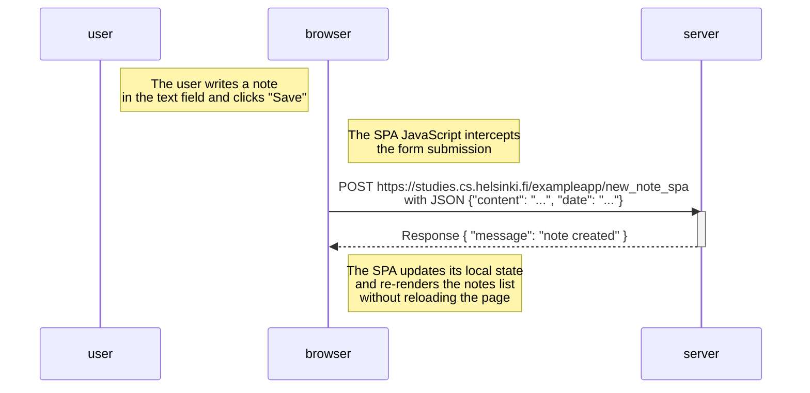

# Sequence Diagram - Creating a New Note in the SPA

```mermaid
sequenceDiagram
    participant user
    participant browser
    participant server

    Note right of user: The user writes a note<br/>in the text field and clicks "Save"

    Note right of browser: The SPA JavaScript intercepts<br/>the form submission

    browser->>server: POST https://studies.cs.helsinki.fi/exampleapp/new_note_spa<br/>with JSON {"content": "...", "date": "..."}
    activate server
    server-->>browser: Response { "message": "note created" }
    deactivate server

    Note right of browser: The SPA updates its local state<br/>and re-renders the notes list<br/>without reloading the page
```