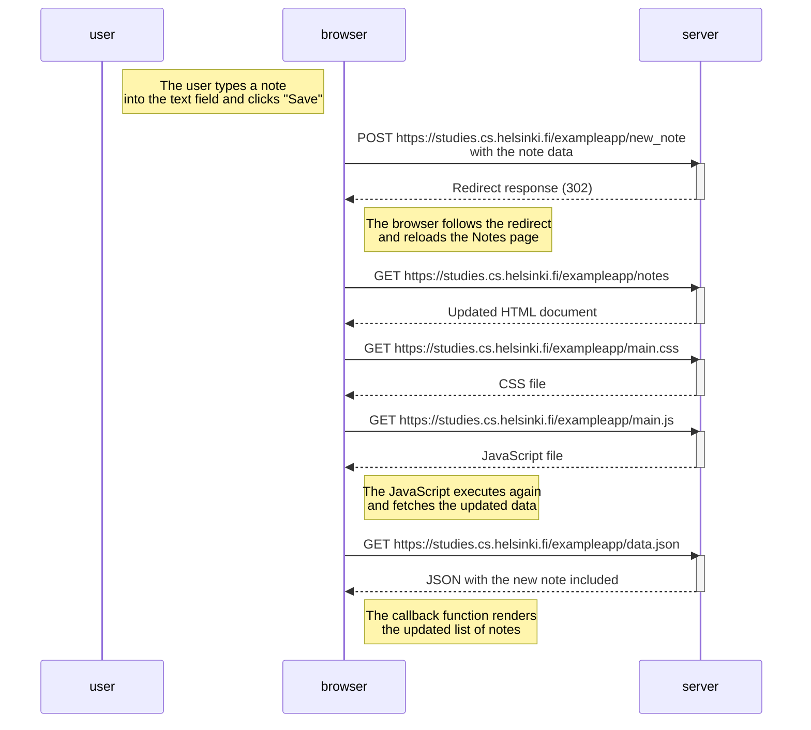

# Sequence Diagram - Creating a New Note

```mermaid
sequenceDiagram
    participant user
    participant browser
    participant server

    Note right of user: The user types a note<br/>into the text field and clicks "Save"

    browser->>server: POST https://studies.cs.helsinki.fi/exampleapp/new_note<br/>with the note data
    activate server
    server-->>browser: Redirect response (302)
    deactivate server

    Note right of browser: The browser follows the redirect<br/>and reloads the Notes page

    browser->>server: GET https://studies.cs.helsinki.fi/exampleapp/notes
    activate server
    server-->>browser: Updated HTML document
    deactivate server

    browser->>server: GET https://studies.cs.helsinki.fi/exampleapp/main.css
    activate server
    server-->>browser: CSS file
    deactivate server

    browser->>server: GET https://studies.cs.helsinki.fi/exampleapp/main.js
    activate server
    server-->>browser: JavaScript file
    deactivate server

    Note right of browser: The JavaScript executes again<br/>and fetches the updated data

    browser->>server: GET https://studies.cs.helsinki.fi/exampleapp/data.json
    activate server
    server-->>browser: JSON with the new note included
    deactivate server

    Note right of browser: The callback function renders<br/>the updated list of notes
```