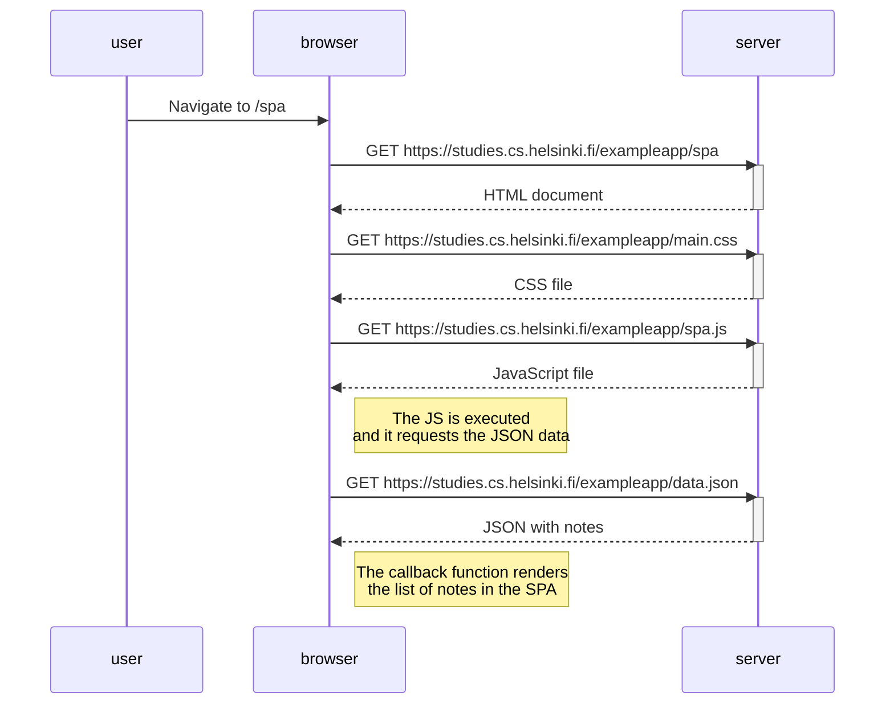

# Sequence Diagram - Loading the Single Page App

```mermaid
sequenceDiagram
    participant user
    participant browser
    participant server

    user->>browser: Navigate to /spa

    browser->>server: GET https://studies.cs.helsinki.fi/exampleapp/spa
    activate server
    server-->>browser: HTML document
    deactivate server

    browser->>server: GET https://studies.cs.helsinki.fi/exampleapp/main.css
    activate server
    server-->>browser: CSS file
    deactivate server

    browser->>server: GET https://studies.cs.helsinki.fi/exampleapp/spa.js
    activate server
    server-->>browser: JavaScript file
    deactivate server

    Note right of browser: The JS is executed<br/>and it requests the JSON data

    browser->>server: GET https://studies.cs.helsinki.fi/exampleapp/data.json
    activate server
    server-->>browser: JSON with notes
    deactivate server

    Note right of browser: The callback function renders<br/>the list of notes in the SPA
```